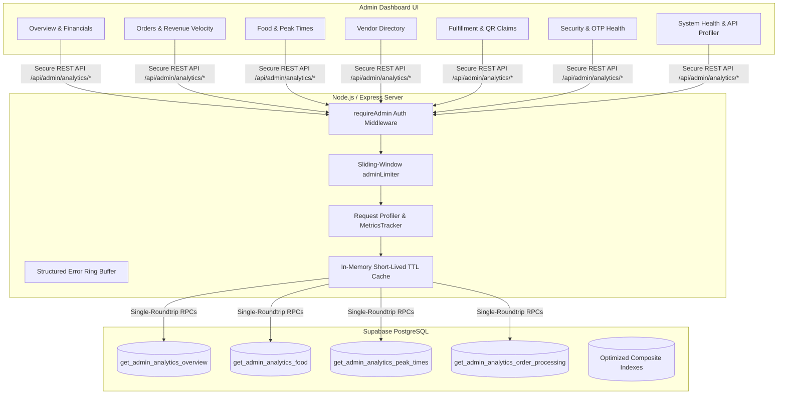

# Campus-Bite Analytics, Monitoring & System Dashboard Architecture (Phase 13)

## 1. Analytics & Monitoring Architecture
The **Campus-Bite Analytics and System Monitoring** subsystem provides real-time telemetry, operational visibility, and aggregated database insights for administrators and platform operators. It is designed to handle high-traffic environments by offloading heavy aggregations to PostgreSQL stored procedures (RPCs), employing in-memory TTL caching, and utilizing bounded ring buffers for latency profiling and structured error tracking without impacting transactional ordering operations.

---

## 2. API Endpoints Suite (`/api/admin/analytics/*`)

All analytics endpoints require strict server-side `requireAdmin` authentication and are rate-limited via `adminLimiter`.

| Method | Endpoint | Description | Auth Required |
|---|---|---|---|
| `GET` | `/api/admin/analytics/overview` | Returns single-roundtrip global KPIs (Students, Vendors, Orders, Revenue, AOV) | Admin |
| `GET` | `/api/admin/analytics/orders` | Returns order status distribution, campus block delivery breakdown, daily timeline | Admin |
| `GET` | `/api/admin/analytics/revenue` | Returns verified gross revenue, today/week/month metrics, AOV, daily revenue velocity | Admin |
| `GET` | `/api/admin/analytics/food` | Returns top 10 and least ordered food items, quantity sold, and item revenues | Admin |
| `GET` | `/api/admin/analytics/peak-times` | Returns hourly order velocity (09:00–18:00), day of week demand, and busiest peak hour | Admin |
| `GET` | `/api/admin/analytics/vendors` | Returns per-vendor station performance, completed/cancelled orders, revenue, avg prep time | Admin |
| `GET` | `/api/admin/analytics/processing-times` | Returns order lifecycle durations (prep time, fastest/slowest prep, pickup duration) | Admin |
| `GET` | `/api/admin/analytics/payments` | Returns payment gateway stats, success/failure rate %, method distribution (Zero Secrets) | Admin |
| `GET` | `/api/admin/analytics/otp` | Returns zero-knowledge aggregated OTP telemetry (requests, success rate %, expired, rate-limited) | Admin |
| `GET` | `/api/admin/analytics/qr` | Returns QR pickup telemetry (claims today, successful, rejected, already claimed, invalid attempts) | Admin |
| `GET` | `/api/admin/analytics/system-health` | Returns backend server status, Node.js memory (RSS/Heap), CPU load, DB latency, Realtime status | Admin |
| `GET` | `/api/admin/analytics/api-metrics` | Returns profiled API request counts, avg response time, p95 latency, error rate %, route breakdown | Admin |
| `GET` | `/api/admin/analytics/errors` | Returns latest 50 sanitized structured error logs from in-memory ring buffer | Admin |

---

## 3. Database Functions & Stored Procedures (`011_analytics_monitoring.sql`)

### Stored Procedures:
1. `get_admin_analytics_overview()`: Single-roundtrip aggregation for student counts, vendor counts, today/week/month order volumes, today/week/month revenues, successful/failed/pending payment tallies, and Average Order Value (AOV).
2. `get_admin_analytics_food(p_start_date, p_limit)`: Expands order items JSON/JSONB in PostgreSQL (`jsonb_array_elements`) and aggregates top and least ordered food items with quantities and revenues.
3. `get_admin_analytics_peak_times(p_start_date)`: Extracts `HOUR` and `DOW` from order timestamps to calculate hourly velocity, busiest ordering hours, and daily demand distribution.
4. `get_admin_analytics_order_processing()`: Computes order lifecycle durations (`ready_at - preparation_started_at` and `claimed_at - ready_at`).

### Composite Indexes Added:
- `idx_orders_created_at_payment_status ON orders (created_at DESC, payment_status)`
- `idx_orders_payment_status ON orders (payment_status)`
- `idx_orders_claimed_at ON orders (claimed_at DESC) WHERE claimed_at IS NOT NULL`
- `idx_orders_ready_at ON orders (ready_at DESC) WHERE ready_at IS NOT NULL`

---

## 4. Dashboard Sections & Visual Telemetry

The **Analytics & System Health** tab in the Admin Dashboard is partitioned into 8 modular sub-views:
1. **Overview & Financials**: High-level telemetry cards for quick assessment of student volume, daily tickets, revenues, and fulfillment completion.
2. **Orders & Revenue Velocity**: Filterable ranges (`1d`, `7d`, `30d`, `this_month`), status distribution badges, campus block distribution, and daily revenue timeline bars.
3. **Food & Menu Velocity**: Top 10 high-velocity snack items and least ordered items for canteen stock management.
4. **Peak Ordering Times**: Visual hourly velocity chart (09:00 to 18:00) with highlight on peak lunch hours (`12:00 - 14:00`).
5. **Vendor Performance Directory**: Multi-counter station audit table showing total orders, completed, cancelled, active queue, total revenue, and average preparation time.
6. **Order Fulfillment & QR Claims**: Breakdown of preparation durations, pickup latencies, and QR verification attempt statistics.
7. **Security & OTP Health**: Real-time aggregated OTP delivery and verification success rates (zero plaintext passcodes stored or exposed).
8. **System Health & API Telemetry**: Node.js heap memory, process uptime, database latency ping, API route group profiler, HTTP status distribution, and sanitized error ring buffer.

---

## 5. Security, Privacy & Data Minimization
- **Strict Server-Side RBAC**: Only authenticated users with verified `admin` role can access `/api/admin/analytics/*`. Non-admin requests (students and vendors) receive `HTTP 403 Forbidden`.
- **Zero Sensitive Data Exposure**: Plaintext passwords, OTP passcodes, OTP HMAC hashes, password reset tokens, Razorpay private secrets, and Supabase service-role keys are never stored in telemetry or returned in API responses.
- **Log Sanitization**: Error logging automatically regex-redacts JWT tokens, Razorpay keys, emails, and 6-digit numeric sequences before appending to the ring buffer.

---

## 6. Caching & Realtime Refresh Strategy
- **Short-Lived In-Memory Cache**: Heavy analytics queries are cached with a **30-second TTL** in `server/supabaseAdmin.js` to protect the database against redundant concurrent admin re-renders.
- **Controlled Refresh**: Analytics dashboard utilizes on-demand refresh buttons and controlled tab-switch fetching. Aggressive interval polling is strictly avoided to preserve client and server performance.

---

## 7. Data Retention Strategy
- **In-Memory Telemetry**: Bounded ring buffer retains only the **latest 50 structured errors** and **latest 200 latency measurements**, ensuring constant \(O(1)\) memory footprint.
- **Database Metrics**: Aggregations are calculated dynamically from transactional tables (`orders`, `profiles`) using indexed date boundaries (`INTERVAL '30 days'`), preventing unbounded table growth.

---

## 8. Verification & Automated Test Results
- Automated test suite `npm run test:phase13` passed: **52 Passed, 0 Failed**.
- Non-regression test suites passed:
  - Phase 8 (Security & Rate Limiting): **58 Passed, 0 Failed**
  - Phase 9 (Production Readiness & Scaling): **62 Passed, 0 Failed**
  - Phase 11 (Admin Dashboard): **30 Passed, 0 Failed**
  - Phase 12 (Vendor Dashboard): **23 Passed, 0 Failed**
- Vite build (`npm run build`) succeeded in **2.29s** with **0 errors**.
