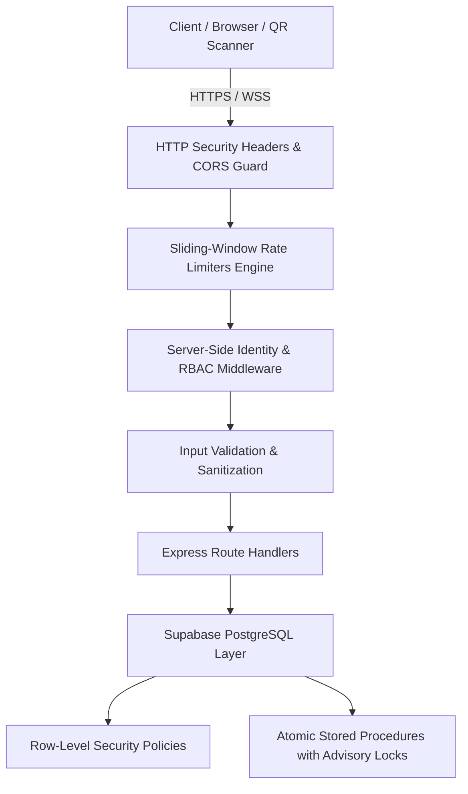

# Campus-Bite Production Security Audit & Hardening Documentation
**Application**: Campus-Bite — College Canteen Ordering & Instant Counter Pickup Platform  
**Target Environment**: High-Traffic Production (~8,000 to 10,000 Campus Users)  
**Security Baseline**: Phase 8 Production Hardening (PostgreSQL RLS, RBAC, Sliding-Window Rate Limiting, CORS, Cryptographic OTP & QR Tokens)  
**Date**: September 2026  

---

## 1. Executive Summary & Security Posture

Campus-Bite is an enterprise-ready campus canteen ordering platform designed for high-concurrency peak rush periods (class breaks, lunch hours). Phase 8 establishes a hardened defense-in-depth posture protecting students, vendors, and canteen administration against unauthorized data access, API abuse, brute force, payment tampering, and privilege escalation.

---

## 2. Row-Level Security (RLS) Architecture & Database Policies

Row-Level Security is explicitly enabled on all core database tables via `supabase/migrations/008_security_hardening.sql`. This ensures that even if client-side credentials or anon keys are used directly, PostgreSQL enforces least-privilege row access.

| Table | RLS Status | Policies Defined | Security Rule Enforced |
| :--- | :--- | :--- | :--- |
| `public.profiles` | **ENABLED** | `profiles_select_own`, `profiles_admin_all`, `profiles_service_role` | Users can only select and modify their own profile record. Admins and service role have full access. |
| `public.students` | **ENABLED** | `students_select_own`, `students_admin_all`, `students_service_role` | Students can only query their own record matching `auth.uid()`. |
| `public.vendors` | **ENABLED** | `vendors_select_public`, `vendors_admin_all`, `vendors_service_role` | Public directory can read active vendor metadata (name, station, block). Sensitive vendor credentials protected. |
| `public.orders` | **ENABLED** | `orders_select_policy`, `orders_vendor_policy`, `orders_admin_all` | Students can only query orders where `student_email = auth.jwt()->>email`. Vendors can only query orders matching their station block. |
| `public.payments` | **ENABLED** | `payments_select_policy`, `payments_admin_all`, `payments_service_role` | Students can only query payments where `student_email = auth.jwt()->>email`. |
| `public.otp_challenges` | **ENABLED** | `otp_challenges_service_only` | Direct client access is completely DENIED. Only the backend `service_role` can create/verify OTP challenges. |

---

## 3. Sliding-Window Rate Limiting Engine

To protect against credential stuffing, brute force, denial of service (DoS), and rapid ticket claiming, categorized in-memory sliding-window rate limiters with leak-free auto-cleanup intervals (`setInterval(...).unref()`) are enforced:

| Limiter Category | Target Endpoints | Rate Limit Threshold | Abuse Vector Mitigated |
| :--- | :--- | :--- | :--- |
| **Auth Limiter** | `POST /api/auth/login` `POST /api/auth/register-student` | **40 req / 15 min** | Brute force credential stuffing, fake account registration flooding |
| **OTP Send Limiter** | `POST /api/send-otp` | **15 req / 15 min** (+ 30s cooldown) | SMS/Email bomb attacks, Brevo API quota exhaustion, mailbox flooding |
| **OTP Verify Limiter** | `POST /api/verify-otp` | **30 req / 15 min** (+ max 5 tries/code) | 6-digit numeric OTP brute force attacks |
| **Password Reset Limiter**| `POST /api/reset-password` | **15 req / 15 min** | Account takeover via reset token guessing |
| **Payment Limiter** | `POST /api/create-order` `POST /api/verify-payment` | **50 req / 10 min** | Payment gateway manipulation, rogue order generation |
| **QR Scan Limiter** | `POST /api/orders/validate-qr` `POST /api/orders/claim` | **120 req / 1 min** | Fast automated QR token guessing, denial of pickup service |
| **Admin Limiter** | `GET /api/admin/stats` `POST /api/vendors/*` | **100 req / 1 min** | Resource-heavy aggregation query flooding, admin API abuse |
| **General API Limiter** | `GET /api/orders` `POST /api/orders` `GET /api/menu` | **200 req / 1 min** | General API flooding and scraping |

---

## 4. Role-Based Access Control (RBAC) & Privilege Escalation Defense

All administrative and vendor mutations strictly require authoritative server-side role verification:
1. **Cryptographic JWT Verification**: Bearer tokens are validated using `supabaseAdmin.auth.getUser(token)`.
2. **Authoritative Profile Check**: The authenticated `user.id` is mapped to `public.profiles.role`.
3. **Privilege Rejection**:
   - Students attempting to claim orders via `/api/orders/claim` receive **HTTP 403 Forbidden**.
   - Students attempting to create vendors via `/api/vendors/create` receive **HTTP 403 Forbidden**.
   - Students attempting to view analytics via `/api/admin/stats` receive **HTTP 403 Forbidden**.
   - Client-side manipulation of `user_metadata` or localStorage role keys is rejected.

---

## 5. Cross-Account Data Isolation & Privacy Protection

1. **Student Order Snooping Defense**:
   - `GET /api/orders`: If the caller is authenticated as a student, the server forces `student_email = caller.email`, preventing students from reading other students' meal records or QR tokens.
2. **Pickup Token Protection**:
   - Pickup tokens are generated using 64-bit cryptographic entropy (`CB-TOKEN-{orderId}-{hexEntropy}`).
   - Pickup tokens do not contain plaintext email, phone numbers, or personal details.
   - Read-only QR validation endpoint `/api/orders/validate-qr` sanitizes student contact details.

---

## 6. Input Validation & Abuse Prevention

1. **Order Input Sanitizer (`validateOrderInput`)**:
   - Rejects order payloads with $>50$ items.
   - Enforces item quantities strictly between $1$ and $50$.
   - Validates that item prices and total amounts are within acceptable non-negative limits.
   - Rejects prototype pollution attempts (`__proto__`, `constructor`).
2. **Price Tampering Defense (`calculateAndValidateOrderAmount`)**:
   - Server-side authoritative price lookup against `CANONICAL_MENU_PRICES` prevents client-side price modification.
   - Coins redeemed cannot exceed student balance or total order value.

---

## 7. Account Enumeration Mitigations

1. **Password Reset OTP Dispatches**:
   - `POST /api/send-otp` with `purpose: 'password_reset'` returns a generic success message:  
     `"If an account exists with this email, a verification code has been sent."`  
     This prevents external adversaries from determining whether a specific student email is registered.
2. **Password Reset Token Verification**:
   - Generic error messages on invalid sessions without exposing database structure or user existence.

---

## 8. HTTP Security Headers & Origin Restriction (CORS)

Express middleware automatically attaches strict HTTP security headers to all responses:

- `X-Content-Type-Options: nosniff` — Prevents MIME-type sniffing.
- `X-Frame-Options: SAMEORIGIN` — Clickjacking protection.
- `X-XSS-Protection: 1; mode=block` — Cross-site scripting filter.
- `Referrer-Policy: strict-origin-when-cross-origin` — Restricts sensitive referrer data.
- `Permissions-Policy: camera=(), microphone=(), geolocation=()` — Disables unused hardware access.
- `Strict-Transport-Security: max-age=31536000; includeSubDomains; preload` — Enforces HTTPS.
- `Content-Security-Policy`: Restricts scripts and connections to self, Supabase, Razorpay, and Brevo.
- `CORS`: Restricts browser origins to authorized domain list (`FRONTEND_URL`, campus domains, localhost during development).

---

## 9. Secret Protection & Environment Hygiene

1. `.gitignore` is configured to prevent committing `.env`, `.env.*`, `*.pem`, `*.key`, `dist/`, and logs.
2. `.env.example` provides sanitized variable placeholders with no exposed credentials.
3. No hardcoded production API keys, service role secrets, or database passwords exist in source files.

---

## 10. Incident Response & Credential Rotation Protocol

If any secret (Supabase Service Role Key, Razorpay Secret, Brevo API Key) is compromised:

1. **Immediate Rotation**:
   - **Supabase**: Access Supabase Dashboard -> Project Settings -> API -> Regenerate `service_role` secret.
   - **Razorpay**: Access Razorpay Dashboard -> Settings -> API Keys -> Generate New Key.
   - **Brevo**: Access Brevo Dashboard -> SMTP & API -> Generate New API Key.
2. **Environment Update**:
   - Update deployment environment variables on Vercel/Render/Docker host.
   - Restart all backend server instances.
3. **Session Invalidation**:
   - In Supabase Auth, trigger global token revocation for affected accounts.
   - Expire all active OTP challenges: `DELETE FROM public.otp_challenges WHERE created_at < NOW();`.
