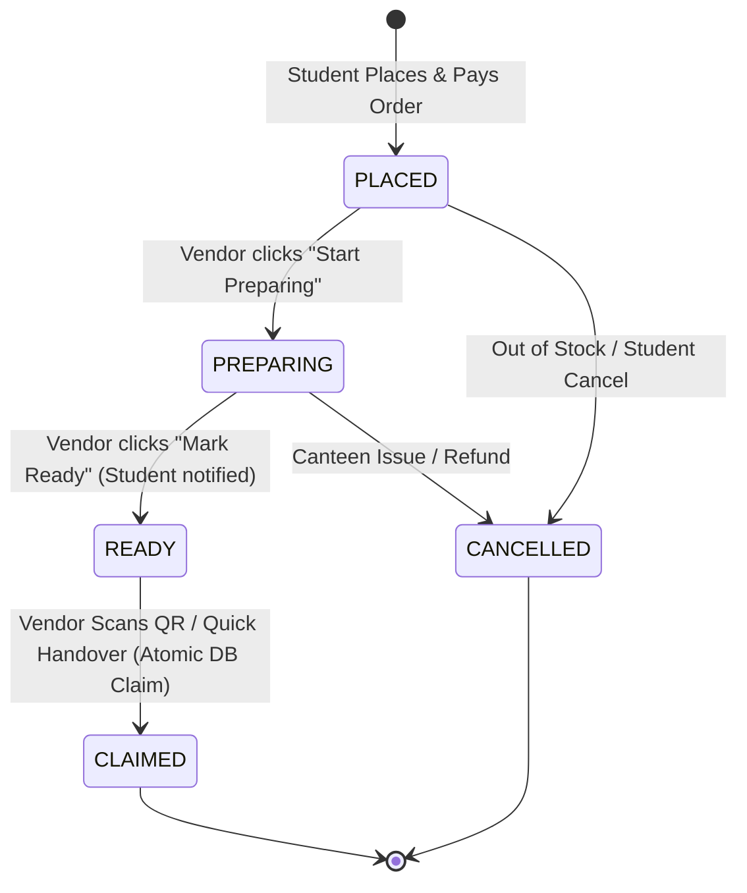

# Campus-Bite Vendor Dashboard & Order Fulfillment Architecture (Phase 12)

## 1. Overview & Objectives
The **Campus-Bite Vendor Dashboard** is a dedicated, production-hardened web interface designed specifically for canteen station operators, counter attendants, and vendors. It provides real-time order monitoring, low-friction preparation workflows, quick QR pickup verification, daily revenue tracking, and instant menu availability controls.

---

## 2. Key Capabilities & Workflow

### Dashboard Tabs & Feature Matrix:
1. **Overview**:
   - Live KPI metric cards (New Orders, Preparing, Ready for Pickup, Completed Today, Today's Sales ₹, Average Prep Time).
   - Realtime Supabase PostgreSQL event channel indicator (`LIVE / RECONNECTED`).
   - Velocity alerts for top in-demand snack items.
2. **Live Order Queue**:
   - Status filters (`ALL`, `NEW`, `PREPARING`, `READY`, `CLAIMED`, `CANCELLED`).
   - Block/Campus filter (`CB`, `ME`, `EE`, `CSE`, `ECE`, `IT`, `MBA`, `Pharmacy`).
   - Order search by token/ID/student name.
   - Quick action buttons: **Start Preparing** (`PLACED` -> `PREPARING`), **Mark Ready** (`PREPARING` -> `READY`), and **Quick Handover** (`READY` -> `CLAIMED`).
   - Modal with full item breakdown, custom notes, block, and customer contact details.
3. **Completed History**:
   - Filter by date (`Today`, `Yesterday`, `Last 7 Days`, `All Time`).
   - Searchable by Order ID or Student Name.
   - Paginated table with timestamp audit trail (`Created`, `Prepared`, `Claimed`).
4. **Sales & Trends Analytics**:
   - Filter range (`Today`, `Last 7 Days`, `Last 30 Days`).
   - Total Gross Revenue, Completed Orders Volume, Average Order Value (AOV).
   - Daily revenue velocity bar charts.
5. **Menu Availability Controls**:
   - Rapid 1-click toggle between **In Stock** and **Out of Stock**.
   - Price, category, and station view for instant inventory protection during rush hours.
6. **Station Profile**:
   - Counter identifier, station assignment, assigned college block, and registered vendor details.

---

## 3. Database Schema & RPC Functions (`010_vendor_dashboard.sql`)

### Added Schema Columns:
- `orders.preparation_started_at TIMESTAMPTZ`
- `orders.ready_at TIMESTAMPTZ`
- `orders.station_name TEXT DEFAULT 'Main Canteen Counter'`

### High-Performance Composite Indexes:
- `idx_orders_vendor_status_created ON orders (vendor_id, status, created_at DESC)`
- `idx_orders_status_block_created ON orders (status, block, created_at DESC)`
- `idx_orders_created_at_status ON orders (created_at DESC, status)`

### Stored Procedures:
1. `get_vendor_dashboard_stats(p_vendor_id)`:
   - Aggregates new, preparing, ready, completed orders, today's sales, and average prep time in a single round trip.
2. `update_order_status_vendor(p_order_id, p_new_status, p_vendor_id)`:
   - Enforces atomic state transitions with `FOR UPDATE` row-level locks.
   - Sets `preparation_started_at` when transitioning to `PREPARING`.
   - Sets `ready_at` when transitioning to `READY`.
   - Sets `claimed_at` when transitioning to `CLAIMED`.

---

## 4. Backend REST API Endpoints & RBAC Protection

All vendor endpoints are strictly protected by `requireVendorOrAdmin` authentication middleware and rate-limited via `vendorLimiter` (120 requests / min sliding window).

| Method | Endpoint | Description | Auth Required |
|---|---|---|---|
| `GET` | `/api/vendor/stats` | Fetches live KPI counts, revenue, and prep time | Vendor / Admin |
| `GET` | `/api/vendor/orders` | Fetches filtered & paginated active/historical orders | Vendor / Admin |
| `POST` | `/api/vendor/orders/:id/status` | Transitions order status (`PREPARING`, `READY`, `CANCELLED`) | Vendor / Admin |
| `GET` | `/api/vendor/sales` | Aggregated sales metrics, volume, and daily velocity | Vendor / Admin |
| `GET` | `/api/vendor/menu` | Retrieves menu items for the vendor's station | Vendor / Admin |
| `PATCH` | `/api/vendor/menu/:id/toggle` | Toggles item stock status (`is_available`) | Vendor / Admin |

---

## 5. Security & RBAC Matrix
- **Anonymous Requests**: Blocked with `HTTP 401 Unauthorized`.
- **Student Accounts**: Blocked with `HTTP 403 Forbidden` (`Vendor role required`).
- **Input Sanitization**: Order status is strictly validated against `['PLACED', 'PREPARING', 'READY', 'CLAIMED', 'CANCELLED']`.
- **Atomic Double-Claim Prevention**: Leverages Phase 6 cryptographic HMAC-SHA256 tokens and database `claim_order_secure` RPC.

---

## 6. Verification & Automated Test Results
- Automated test suite `npm run test:phase12` passed: **23 Passed, 0 Failed**.
- Non-regression test suites passed:
  - Phase 8 (Security & Rate Limiting): **58 Passed, 0 Failed**
  - Phase 9 (Production Readiness & Scaling): **62 Passed, 0 Failed**
  - Phase 11 (Admin Dashboard): **30 Passed, 0 Failed**
- Vite build (`npm run build`) succeeded with 0 errors.
